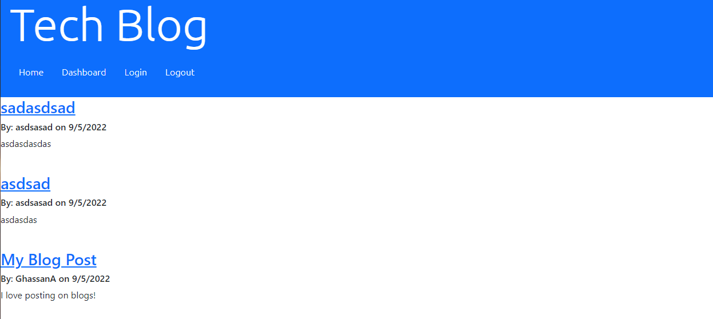

# Tech Blog

## Table of Contents
  - [Description](#description)
  - [Usage](#usage)
  - [Issues](#issues)
  - [Demo](#demo)

## Description
This application is a website that functions as a blog. Users will be able to create an account and make posts for other users to view.

## Usage
Simply click on the login page to create an account and then you will be able to post! The website is accessible <a href='https://tech-blog-by-ghassan.herokuapp.com/'>here</a>.

## Issues
Currently, it is not possible to view posts on the user's dashboard and by extension, it will not be possible to delete posts.

## Demo
Here is an idea of what the website will look like: 

